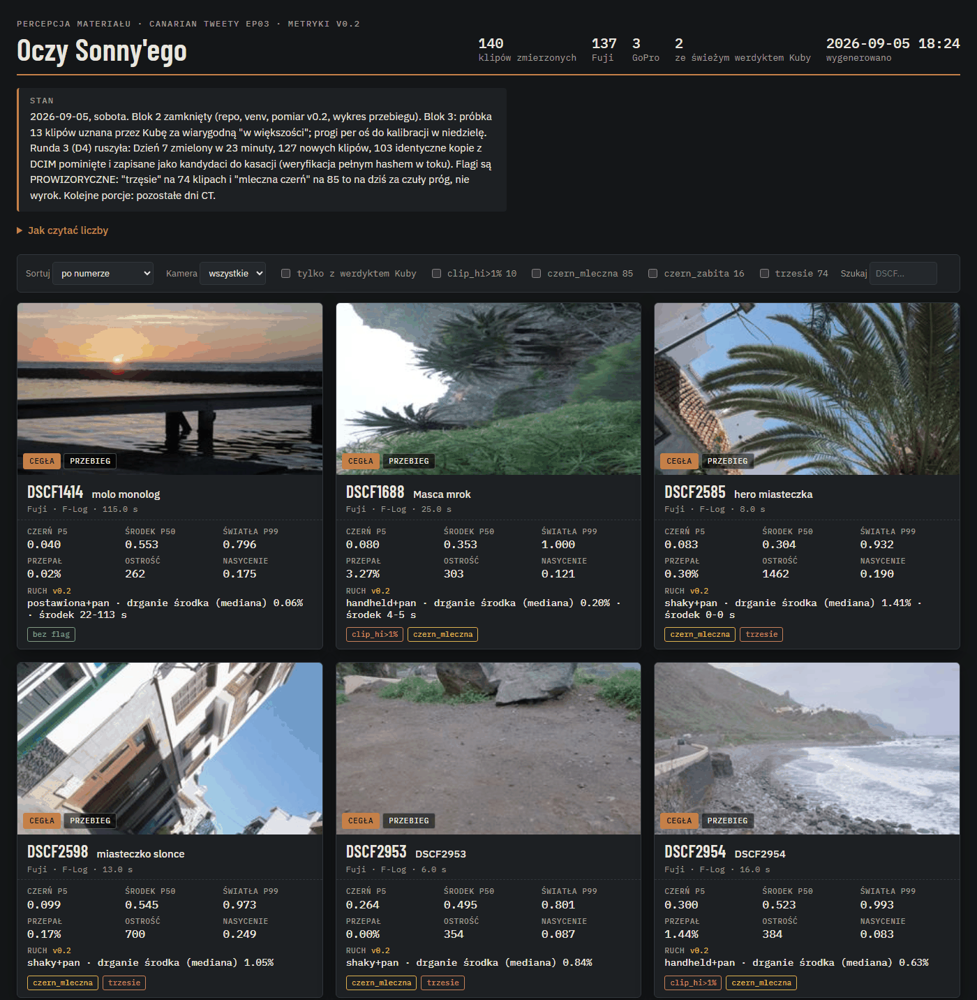
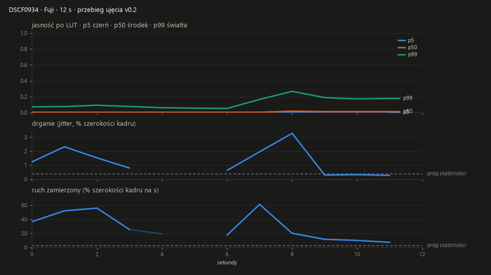
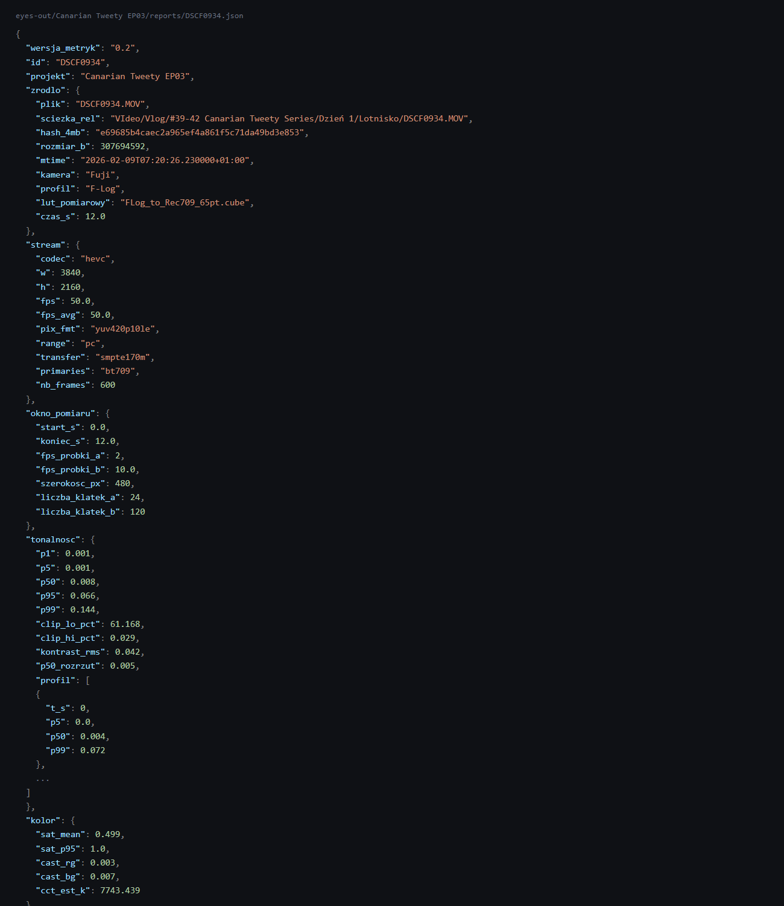
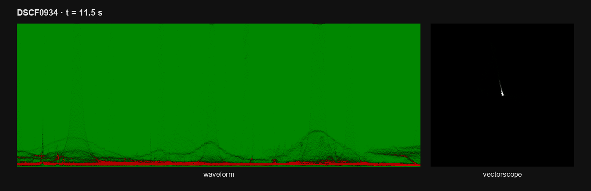

🇵🇱 Polski | [🇬🇧 English](README.en.md)

# sonny-eyes

Pomiar percepcyjny ujęć wideo: bierze klip z kamery i zamienia go w liczby
(tonalność, kolor, ostrość, szum, ruch kamery, przebieg jasności), zapisuje
raport JSON per klip i stronę przeglądu HTML, a agentom AI udostępnia te dane
przez serwer MCP. Dla twórców wideo, którzy pracują z modelami AI, i dla
agentów, które mają "obejrzeć" materiał, a fizycznie nie potrafią.

 <!-- TODO screenshot -->
 <!-- TODO screenshot -->
 <!-- TODO screenshot -->

## Problem: jak AI ogląda film

Model nie widzi pikseli. Widzi siatkę kwadratów. Obraz jest cięty na patche
(u Claude 28x28 px), każdy patch spłaszczany do wektora liczb, a oryginalne
piksele znikają - nie ma do nich powrotu, nie da się "przybliżyć". Klatka 4K
nigdy nie dociera w 4K: jest skalowana do 2576 px dłuższego boku, czyli siatki
92 x 52 = 4784 patche. To sufit, więcej nie będzie, choćbyś dał 8K. Do tego
zero metadanych: żadnego EXIF, żadnego ICC, żadnej informacji, że to F-Log
albo 10-bit.

Enkoder wizyjny jest trenowany tak, żeby dopasować obraz do TEKSTU (trening
kontrastywny obraz-opis), a nie żeby zachować wierność fotometryczną. Nikt tej
sieci nigdy nie uczył trzymać wartości luminancji. Efekt jest przewidywalny:
model uczciwie powie "ciepłe", "płaskie", "przepalone", ale nie powie "czerń na
6 IRE" ani "300 K za ciepło". Sonny, agent, dla którego to narzędzie powstało,
podsumował to tak: *"widzę treść i nastrój kadru, nie widzę wartości, a filmu
nie widzę w ogóle, bo dostaję garść nieruchomych zdjęć."*

Z filmem jest gorzej, bo nikt nie ogląda filmu. W API Claude nie ma bloku
"video" - obsługiwane są JPEG, PNG, GIF (bez animacji) i WebP, więc jedyna
droga to wyciąć klatki ffmpegiem i wysłać jako sekwencję obrazów. Gemini
przyjmuje plik wideo, ale dokumentacja opisuje to wprost jako "sequence of
frames" próbkowane domyślnie z częstotliwością 1 klatki na sekundę, bez
dedykowanego kanału optical flow. Modele open-weight robią to samo, tylko
jawniej.

Konkret z prawdziwego materiału: kamera nagrywa 50 klatek na sekundę, okno
8 sekund to 400 klatek. Przy próbkowaniu 1 fps model dostaje z tego 8 klatek.
392 klatki, w których żyje całe drganie, po prostu nie istnieją. Nie "są słabo
widoczne" - nie ma ich. A stabilność, judder, duplikaty klatek i tempo montażu
są właśnie własnością relacji MIĘDZY klatkami, nie pojedynczej klatki.

Benchmarki mówią to samo liczbami. **ColorBench**: podanie dokładnego koloru
punktu to najtrudniejsze zadanie percepcyjne w całym zbiorze, najlepszy wynik
57.3%; rozpoznanie dominującego koloru idzie znacznie lepiej (najlepszy 82.9%
przy człowieku 92.0%) - czyli kategoria tak, wartość nie. **ShotBench**
(3.5k eksperckich pytań z ponad 200 filmów, 24 modele): najlepszy poniżej 60%
średniej, a ruch kamery to najtrudniejszy wymiar - GPT-4o 48.3%, Qwen2.5-VL-72B
48.9%, Gemini-2.5-flash 43.5%. **CameraBench** testuje wprost skalę
stabilności (static, no shaking, minimal shaking, unsteady, very unsteady) i
większość open-source VLM wypada na poziomie przypadku albo poniżej.
**MotionBench**: najlepsze video-LLM poniżej 0.60, a w kategorii liczenia
powtórzeń ruchu "all models scored near random".

To nie jest problem akademicki, tylko rachunek za czas. Przy serii Canarian
Tweety plik DCTL o nazwie WARMTH był no-opem przez cały odcinek EP02 i nikt
tego nie zauważył - ani agent, ani autor. Jeden pomiar delty przed i po
wyłapałby to w sekundę; oglądanie nie wyłapało przez cały odcinek. Wcześniej,
przy EP01, AI wyprodukowało 36 renderów TIFF i 3 kontaktówki do porównania
looków A/B/C, na których delty były praktycznie niewidoczne: 30 minut w błoto.
Werdykty autora na kolejnych iteracjach brzmiały: *"nie widzę żadnej różnicy,
za mało mordo"*, potem *"kompletnie nie widzę tego warmtha nigdzie"*, po
podbiciu *"za żółto"*. Każda z tych rund to był przejazd człowieka w viewerze,
bo pomiaru nie było.

 <!-- TODO screenshot -->

## Rozwiązanie: mierz, nie patrz

Zasada jest jedna: **narzędzia mierzą, model interpretuje**. To narzędzie robi
tylko pierwszą połowę.

Cały stack percepcji ma trzy warstwy i one nie są wymienne - każda odpowiada na
inne pytanie i kłamie, gdy użyć jej do cudzego:

1. **Fizyka (liczby).** Percentyle luminancji, saturacja, cast, wariancja
   laplasjanu, wektor przesunięcia między klatkami. Tanie, powtarzalne,
   obiektywne. Odpowiadają na "ile", nigdy na "czy dobrze". To jest warstwa,
   którą robi `sonny-eyes`.
2. **Kontrola wzrokowa (skopy).** Waveform, vectorscope, wykres przebiegu i
   pojedyncze klatki jako PNG. Tutaj człowiek albo model faktycznie patrzy, ale
   na wykres, nie na obraz. Wykres czyta się pewniej niż tabelę liczb i
   kosztuje mniej tokenów niż pełna klatka. `sonny-eyes` te obrazy generuje.
3. **Semantyka (model).** Plan, ruch kamery, treść, rola montażowa, "czy jest
   ciekawie". Jedyna warstwa, która umie powiedzieć "ciekawie", i jedyna, która
   potrafi się pomylić z pełnym przekonaniem. Dlatego idzie na końcu i zawsze
   na klatkach wybranych przez warstwę 1. Tego `sonny-eyes` NIE robi.

Fundamentem jest raport ujęcia: jeden JSON na klip, plus ścieżki do klatek i
skopów. Kontrakt tego raportu:

- **`null` zamiast zgadywania.** Metryka, której nie dało się policzyć
  (sekunda bez wystarczającej faktury do trackingu, szacunek temperatury
  barwowej, który wyszedł poza sensowny zakres), zapisuje się jako `null`, nie
  jako fikcyjne zero.
- **Jawna niepewność.** Pole `niepewnosc` mówi wprost, co poszło nie tak przy
  tym konkretnym pomiarze: czy klip Fuji zmierzono bez LUT, czy kamera jest
  nierozpoznana, czy GPU spadło na CPU, czy okno pomiarowe było krótsze niż
  zamówione.
- **`werdykty` zawsze `null`.** Ocenę wpisuje człowiek, nigdy skrypt. Automat
  jest klasyfikatorem, nie wykonawcą: flaguje i sortuje, decyduje człowiek.
- **Progi jadą razem z danymi.** Pole `progi_prowizoryczne` zapisuje w KAŻDYM
  raporcie komplet progów użytych do flag i klasyfikacji ruchu, więc stary
  pomiar da się odróżnić od nowego i zinterpretować po zmianie progów. To samo
  robi `wersja_metryk`.

### Co mierzy

- **Tonalność.** Percentyle jasności p1 / p5 / p50 / p95 / p99 (luma BT.709 w
  skali 0-1), procent pikseli wypalonych w dole i pod sufitem, kontrast RMS,
  rozrzut mediany między klatkami, plus profil jasności co sekundę (p5 / p50 /
  p99) na całej długości klipu.
- **Kolor.** Nasycenie średnie i p95, cast R-G i B-G, szacunek temperatury
  barwowej (McCamy 1992, przez `colour-science`).
- **Ostrość.** Wariancja laplasjanu: średnia, minimum i maksimum po klatkach
  okna, plus siatka 3x3 z najostrzejszej klatki (żeby wiedzieć, czy ostry jest
  obiekt, czy całe pole).
- **Szum.** Estymata sigma z najostrzejszej klatki (`skimage.restoration.estimate_sigma`).
- **Ruch kamery.** Cechy (`goodFeaturesToTrack`) + optical flow
  (`calcOpticalFlowPyrLK`) + transformacja afiniczna z RANSAC
  (`estimateAffinePartial2D`) między kolejnymi próbkami. RANSAC odrzuca punkty
  na ruchomych obiektach (liście, przechodnie) jako outliery, zostawiając ruch
  samej kamery. Wynik: profil co sekundę (ruch zamierzony, jitter, pewność
  pomiaru), odcinki stabilne i w ruchu, najdłuższy odcinek stabilny, osobna
  informacja o pierwszych i ostatnich 2 sekundach, oraz klasa ujęcia
  (`postawiona` / `static` / `handheld` / `shaky`, plus niezależnie `pan`).
- **Płynność.** Flaga VFR (rozjazd `r_frame_rate` i `avg_frame_rate`), liczba
  duplikatów klatek, średnia różnica między kolejnymi klatkami.
- **Montaż.** Długość klipu. Wykrywanie cięć jeszcze nie jest zaimplementowane
  (`montaz.segmenty` jest zawsze puste).
- **Obrazy.** Pierwsza klatka, najostrzejsza klatka, waveform, vectorscope i
  wykres przebiegu ujęcia (trzy panele: jasność po LUT, drganie, ruch
  zamierzony) - wszystko PNG.

Metryki tonalności, koloru, ostrości i szumu liczą się z krótkiego okna
(domyślnie 5-25 s; klip krótszy niż 30 s mierzony jest w całości od 0),
próbkowanego 2 klatki na sekundę przy szerokości 480 px, po LUT. Ruch i profil
jasności to osobna próbka: cały klip od 0 s, 10 klatek na sekundę do 60 s
długości i 5 klatek na sekundę powyżej, twardy limit 180 sekund materiału.

### Czego NIE robi

- **Zero AI w samym pomiarze.** To ffmpeg, numpy, OpenCV, scikit-image i
  colour-science. Żaden model nie jest ładowany, nic nie leci do żadnego API.
- **Zero werdyktów.** Narzędzie nie powie, czy ujęcie jest dobre. Pole
  `werdykty` w raporcie jest zawsze `null`.
- **Zero renderów i eksportów.** Nie generuje wersji materiału, nie dotyka
  DaVinci Resolve ani żadnego NLE.
- **Nic nie modyfikuje.** Pliki źródłowe są czytane i nigdy nie zapisywane.
  Narzędzie pisze wyłącznie do własnego katalogu wyjściowego. Raporty są
  regenerowalne: skasowanie JSON-a i ponowny pomiar odtwarza go od zera. Nic
  poza samymi klipami z kamery nie jest tu źródłem prawdy.
- **Nie wykrywa cięć** (na razie) i **nie robi warstwy semantycznej**.

## Szybki start

### Wymagania

- Python 3.12 lub nowszy (rozwijane i testowane na 3.12.10).
- `ffmpeg` i `ffprobe` w PATH. Rozwijane na buildzie 8.0.1; niektóre obejścia
  w kodzie są podyktowane zachowaniem tej wersji (patrz "Ograniczenia i
  pułapki").
- Opcjonalnie karta NVIDIA. Każde wywołanie ffmpeg próbuje najpierw
  `-hwaccel cuda`, a przy błędzie automatycznie ponawia na CPU. Fallback jest
  wbudowany i odnotowany w raporcie (`niepewnosc.gpu_fallback_cpu`), więc
  narzędzie działa bez GPU. Można też wymusić CPU flagą `--no-gpu`.
- **Testowane wyłącznie na Windows 11 z RTX 4080 Laptop. macOS i Linux nie
  były sprawdzone.** Kod nie ma jawnych zależności od Windows poza ścieżkami w
  przykładach i obejściami ffmpeg, ale nikt tego nie odpalił na innym systemie
  - jeśli spróbujesz, zgłoszenie z wynikiem jest mile widziane.

### Instalacja

```bash
git clone https://github.com/JDHole/sonny-eyes.git
cd sonny-eyes
python -m venv .venv
.venv\Scripts\activate         # Windows
# source .venv/bin/activate    # macOS / Linux
pip install -r requirements.txt
```

`requirements.txt` to minimalny zestaw dziewięciu pakietów potrzebnych do
pomiaru i serwera MCP (instalacja około 1-2 minut, około 0,6 GB). Pełne
środowisko deweloperskie autora siedzi w `requirements.lock` i nie jest
potrzebne do uruchomienia narzędzia. Sprawdzenie instalacji:
`python -m eyes --version`.

### Pierwszy pomiar

```bash
python -m eyes measure --project demo --files clip.mp4
```

Wynik ląduje pod `./eyes-out` względem bieżącego katalogu:

```
eyes-out/demo/reports/clip.json          <- raport
eyes-out/demo/clip/frames/*.png          <- pierwsza i najostrzejsza klatka
eyes-out/demo/clip/scopes/*.png          <- waveform, vectorscope, przebieg
eyes-out/demo/_log.jsonl                 <- log: jedna linia na klip na uruchomienie
```

Kilka plików naraz: `--files a.MOV b.MP4` (albo z powtórzoną flagą:
`--files a.MOV --files b.MP4`); tak samo działa `--folder` w `batch`. Domyślnie klip, który ma już raport, jest
pomijany - `--force` wymusza ponowny pomiar. Okno pomiarowe zmieniają
`--window-start` i `--window-len`.

### Przemiał folderu

```bash
python -m eyes batch --project demo --folder "D:/kamera/dzien-1"
```

Skanuje folder rekurencyjnie i mierzy wszystko, co pasuje. **Uwaga: w tej
wersji filtr nazw jest zaszyty pod dwie kamery autora** - `DSCF*.MOV` (Fuji)
oraz `GX*.MP4`, `GH*.MP4`, `GOPR*.MP4` (GoPro). Reszta plików w folderze jest
pomijana. Pojedyncze pliki o dowolnej nazwie mierzy `measure --files`.

Przerwanie w dowolnym momencie jest bezpieczne: ponowne uruchomienie pomija
klipy, które mają już raport. Postęp z paskiem i ETA leci do
`eyes-out/demo/_postep.json` (zapis atomowy po każdym pliku, więc czytelnik
nigdy nie zobaczy połowy JSON-a).

Przemiał w tle, bez trzymania terminala:

```bash
python -m eyes batch --project demo --folder "D:/kamera/dzien-1" --detach
python -m eyes status --project demo          # albo --json
python -m eyes stop --project demo            # ubija całe drzewo procesów, z ffmpegiem
```

Inne przydatne flagi `batch`: `--limit N` (tylko pierwsze N plików, do testu
porcji), `--porcja "Dzień 1"` (etykieta zapisywana w `_postep.json`).

### Strona przeglądu

```bash
python -m eyes review --project demo
```

Buduje `eyes-out/demo/_przeglad.html`: jedna strona z cegłami (najostrzejsza
klatka każdego klipu), liczbami, flagami, sortowaniem i filtrowaniem. Obrazy
wchodzą jako data URI, więc plik działa bez dostępu do katalogu wyjściowego i
można go wysłać jednym plikiem. `--out-file sciezka.html` dokłada kopię pod
wskazaną ścieżką, `--compact` zamienia pełne PNG na małe JPEG-i (pod limity
rozmiaru artefaktów), `--status "tekst"` wstawia baner na górze strony.

### Duplikaty

```bash
python -m eyes dupes --project demo
python -m eyes dupes --project demo --verify
```

Podczas pomiaru pliki o identycznym `hash_4mb` (sha1 pierwszych 4 MB) jak
wcześniejszy plik na liście są rozpoznawane jako duplikat treści i mierzone
tylko raz. `dupes` wypisuje te pary z logu jako listę do decyzji, a `--verify`
liczy sha1 CAŁYCH plików obu stron i oznacza pary jako "identyczne" albo
"RÓŻNE" (różne = zgadzały się tylko pierwsze 4 MB, taki plik nie jest
kandydatem do kasacji). **Nigdy nic nie kasuje** - to decyzja człowieka.

### Przebieg ujęcia

```bash
python -m eyes profile --project demo
python -m eyes profile --project demo --ids DSCF0934 DSCF0935
```

Rysuje wykres przebiegu z ISTNIEJĄCEGO raportu, bez ponownego dekodowania.
Trzy panele na wspólnej osi czasu: jasność po LUT (p5 / p50 / p99), drganie
(jitter jako procent szerokości kadru) i ruch zamierzony (procent szerokości
kadru na sekundę), z zaznaczonymi progami i odcinkami stabilnymi. Raport bez
pola `tonalnosc.profil` (sprzed tej funkcji) jest pomijany z komunikatem.

### Test dymny

```bash
python tests/test_smoke.py
```

Bramka bez pytest: pliki w `tests/` uruchamia się jako zwykłe skrypty.

## Dla agentów AI

Serwer MCP startuje jedną komendą:

```bash
python -m eyes mcp
```

Claude Code:

```bash
claude mcp add sonny-eyes -- /sciezka/do/.venv/bin/python -m eyes mcp
```

Claude Desktop (`claude_desktop_config.json`):

```json
{
  "mcpServers": {
    "sonny-eyes": {
      "command": "C:/sciezka/do/sonny-eyes/.venv/Scripts/python.exe",
      "args": ["-m", "eyes", "mcp"],
      "env": {
        "EYES_OUT": "C:/sciezka/do/eyes-out"
      }
    }
  }
}
```

Serwer wystawia osiem narzędzi:

| Narzędzie | Co robi |
|---|---|
| `probe_clip` | Zwraca parametry strumienia z ffprobe (kodek, rozdzielczość, fps, pix_fmt, zakres, długość) bez mierzenia czegokolwiek. |
| `measure_clip` | Mierzy jeden klip i zapisuje raport ujęcia. |
| `get_report` | Zwraca gotowy raport JSON konkretnego klipu. |
| `list_reports` | Wypisuje raporty istniejące w projekcie. |
| `batch_start` | Startuje przemiał folderu jako proces w tle. |
| `batch_status` | Zwraca postęp przemiału (zrobione, błędy, ETA). |
| `batch_stop` | Zatrzymuje przemiał w tle. |
| `review_page` | Buduje stronę przeglądu HTML dla projektu. |

Do tego skill: katalog `skill/sonny-eyes/` kopiuje się do `.claude/skills/`
projektu (albo do `~/.claude/skills/`). Skill uczy agenta, kiedy sięgnąć po
pomiar zamiast po patrzenie, i jak czytać pola raportu.

Szczegóły konfiguracji, uprawnień i przykładowe wywołania: [docs/mcp.md](docs/mcp.md).

## Wynik

### Układ folderów

Wszystkie ścieżki są konfigurowalne (patrz "Konfiguracja"); poniżej wersja
domyślna, czyli wszystko pod `./eyes-out` względem bieżącego katalogu.

```
eyes-out/
  _luts/                             kopie LUT-ów użytych do pomiaru
  <projekt>/
    reports/<id>.json                raport ujęcia, jeden na klip
    <id>/frames/<id>_pierwsza.png
    <id>/frames/<id>_najostrzejsza.png
    <id>/scopes/<id>_waveform.png
    <id>/scopes/<id>_vectorscope.png
    <id>/scopes/<id>_przebieg.png
    _log.jsonl                       jedna linia JSON per klip per uruchomienie
    _postep.json                     postęp przemiału (tylko batch)
    _runner.json                     pid i komenda procesu w tle (tylko --detach)
    _batch.log                       stdout i stderr procesu w tle
    _przeglad.html                   strona przeglądu (tylko review)
```

`id` to nazwa pliku bez rozszerzenia (`DSCF3236`). Kolizja nazw w jednym
uruchomieniu daje `nazwa@folder_nadrzedny`. Nazwa raportu to zawsze
`{id}.json`.

`_log.jsonl` ma jedną linię na klip na uruchomienie: id, nazwa pliku, status
(`ok` / `pominieto` / `duplikat` / `blad`), czas, wersja metryk, a przy
błędzie treść błędu. `_postep.json` jest nadpisywany atomowo po każdym pliku i
zawiera: projekt, porcję, listę folderów, status (`w toku` / `zakonczony` /
`zakonczony z bledami` / `przerwany`), liczniki (plików, zrobione, ok,
pominięte, duplikaty, błędy), średni czas, ETA i ostatni przetworzony plik.

### Kształt raportu

Skrót prawdziwego raportu (klip Fuji 4K50, 12 s, ujęcie z ręki w ruchu; tablice
`profil`, `odcinki` i `siatka_3x3` skrócone):

```json
{
  "wersja_metryk": "0.2",
  "id": "DSCF0934",
  "projekt": "Canarian Tweety EP03",
  "zrodlo": {
    "plik": "DSCF0934.MOV", "kamera": "Fuji", "profil": "F-Log",
    "lut_pomiarowy": "FLog_to_Rec709_65pt.cube",
    "hash_4mb": "e69685b4caec2a965ef4a861f5c71da49bd3e853",
    "rozmiar_b": 307694592, "czas_s": 12.0
  },
  "stream": {
    "codec": "hevc", "w": 3840, "h": 2160, "fps": 50.0, "fps_avg": 50.0,
    "pix_fmt": "yuv420p10le", "range": "pc", "transfer": "smpte170m",
    "primaries": "bt709", "nb_frames": 600
  },
  "okno_pomiaru": {
    "start_s": 0.0, "koniec_s": 12.0, "fps_probki_a": 2, "fps_probki_b": 10.0,
    "szerokosc_px": 480, "liczba_klatek_a": 24, "liczba_klatek_b": 120
  },
  "tonalnosc": {
    "p1": 0.001, "p5": 0.001, "p50": 0.008, "p95": 0.066, "p99": 0.144,
    "clip_lo_pct": 61.168, "clip_hi_pct": 0.029,
    "kontrast_rms": 0.042, "p50_rozrzut": 0.005,
    "profil": [{"t_s": 0, "p5": 0.0, "p50": 0.004, "p99": 0.072}]
  },
  "kolor": {"sat_mean": 0.499, "sat_p95": 1.0, "cast_rg": 0.003, "cast_bg": 0.007, "cct_est_k": 7743.439},
  "ostrosc": {"lapvar": 52.285, "lapvar_min": 21.624, "lapvar_max": 124.618,
              "siatka_3x3": [47.258, 209.048, 185.412], "skala_pomiaru_px": 480},
  "szum": {"sigma": 0.002},
  "ruch": {
    "ruch_zamierzony_pct_s": 30.144, "jitter_rms_pct": 1.733,
    "mediana_jitter_pct": 1.016, "p90_jitter_pct": 2.416,
    "profil": [{"t_s": 0, "ruch_pct": 36.611, "jitter_pct": 1.236, "conf": 0.857}],
    "odcinki": [{"od_s": 0, "do_s": 11, "typ": "ruch"}],
    "srodek": null, "brzegi": {"poczatek_ruch": false, "koniec_ruch": false},
    "pary_niepewne": 31, "klasa": ["shaky", "pan"],
    "zrodlo": "lk_ransac_affine", "obcieto_s": null
  },
  "plynnosc": {"vfr": false, "duplikaty": 0, "tdiff": 0.01},
  "montaz": {"dlugosc_s": 12.0, "segmenty": []},
  "flagi_prowizoryczne": ["czern_zabita", "trzesie"],
  "werdykty": null,
  "niepewnosc": {"pomiar_bez_lut": false, "kamera_nieznana": false,
                 "gpu_fallback_cpu": false, "okno_krotsze_niz_zadane": true},
  "pomiar": {"czas_dekodowania_s": 5.841, "czas_calkowity_s": 7.734, "gpu": true,
             "ffmpeg": "8.0.1-full_build-www.gyan.dev", "opencv": "5.0.0"}
}
```

Nazwy pól są po polsku i to jest świadoma decyzja: raport jest kontraktem
danych, który już czytają inne narzędzia autora, więc nie zmienia się go dla
kosmetyki. Pełny słownik pól po angielsku - typ, znaczenie, pułapki - leży w
[docs/report-fields.md](docs/report-fields.md).

### Strona przeglądu

`review` składa wszystkie raporty projektu w jedną stronę HTML: kafelek na klip
z najostrzejszą klatką (przełączaną na waveform i wykres przebiegu), sześć
najważniejszych liczb, flagi, klasa ruchu, sortowanie (po numerze, po czerni,
po przepale, po ostrości, po drganiu) i filtry po fladze i kamerze. Na górze
jest sekcja "Jak czytać liczby" z opisem każdej metryki w języku, a nie w
matematyce.

 <!-- TODO screenshot -->

## Konfiguracja

Bez żadnej konfiguracji narzędzie działa od razu i pisze wszystko pod
`./eyes-out` względem bieżącego katalogu. Żeby to zmienić, skopiuj
`config.example.toml` do `config.toml` obok repo i odkomentuj to, czego
potrzebujesz. `config.toml` jest w `.gitignore` - to plik z lokalnymi
ścieżkami, nie wchodzi do repo.

```toml
# Główny katalog wyjściowy, gdy nic innego nie jest ustawione.
out_root = "./eyes-out"

# Cache per klip: klatki, skopy, _log.jsonl, _postep.json, _luts/.
# Domyślnie to samo co out_root.
cache_root = "./eyes-out"

# Gdzie lądują gotowe raporty JSON. MUSI zawierać znacznik "{project}",
# podstawiany nazwą z --project. Domyślnie "{cache_root}/{project}/reports".
reports_root = "./eyes-out/{project}/reports"

# LUT per kamera. Klucz = nazwa kamery jak w polu zrodlo.kamera raportu,
# małymi literami ("fuji", "gopro"); wartość = ścieżka do pliku .cube,
# nakładanego przed pomiarem klipów tej kamery.
[lut]
fuji = "C:/sciezka/do/FLog_to_Rec709.cube"
```

Kamera spoza tabeli `[lut]` (albo brak tabeli) jest mierzona bez LUT, co
odnotowuje `niepewnosc.pomiar_bez_lut` w raporcie. Flaga `--lut sciezka.cube`
nadpisuje całą tabelę i wymusza jeden LUT na każdym klipie, niezależnie od
kamery.

Zmienne środowiskowe:

- `EYES_OUT` - główny katalog wyjściowy, to samo co `out_root`.
- `EYES_CONFIG` - jawna ścieżka do pliku `config.toml`.

**Kolejność nadpisań (wygrywa pierwsze):** flagi CLI (`--out`, `--config`,
`--lut`) > zmienne środowiskowe (`EYES_OUT`, `EYES_CONFIG`) > `config.toml` >
wbudowane domyślne. `--out X` jest twardsze niż wygląda: ustawia naraz
`out_root`, `cache_root` i `reports_root`, nadpisując także jawny
`reports_root` z configu - inaczej `--out` do katalogu tymczasowego nadal
pisałby raporty w miejscu z configu.

## Ograniczenia i pułapki

**Progi są prowizoryczne.** Progi flag i klasyfikacji ruchu
(`jitter_stabilny_max` 0.4, `ruch_stabilny_max` 3.0, `jitter_shaky_min` 0.6 i
reszta) zostały skalibrowane ręcznie na TRZECH klipach z werdyktem autora
(kamera położona na murku, ujęcie hero z ręki, ujęcie ze statywu), nie na
zróżnicowanej próbce. Startowały z przybliżenia literaturowego i zostały
podniesione, bo na prawdziwym materiale fragmentowały jeden długi stabilny
odcinek na kilkanaście krótkich. Traktuj je jak punkt startowy do kalibracji na
własnym materiale, nie jak standard. Dlatego jadą w każdym raporcie jako
`progi_prowizoryczne` - da się przeliczyć klasyfikację po zmianie progów bez
ponownego pomiaru.

**Czego metryka ruchu v0.2 nie łapie:**

1. Rotacja i skala są liczone z macierzy afinicznej, ale nieużywane. Rolka
   kamery i zoom podczas ujęcia nie mają dziś wpływu na klasę.
2. "Pan" liczy się ze średniej z modułu wygładzonego przesunięcia, nie z
   uśrednionego WEKTORA, więc bardzo silny chaotyczny jitter może w skrajnym
   przypadku też dopisać "pan".
3. Sceny o niskiej fakturze (czyste niebo, wypalona ściana) dają za mało cech
   do trackingu - pary albo całe sekundy kończą jako `null`, nie jako fikcyjne
   zero.
4. `ruch.brzegi` patrzy sztywno na pierwsze i ostatnie 2 sekundy. Odkładanie
   kamery trwające wyraźnie dłużej może częściowo wyciec poza to okno.
5. Rozpad trackingu (ręka zasłaniająca obiektyw przy starcie albo stopie
   nagrania) potrafi dać pojedynczą sekundę z fizycznie bezsensownym
   `ruch_pct` przy niskim `conf`. Agregaty i bramka brzegów są przed tym
   zabezpieczone (medianą i minimalną pewnością), ale surowy `ruch.profil`
   nadal takie wartości pokazuje.
6. Duży obiekt poruszający się spójnie w kadrze (sylwetka balansująca pod
   wiatr) może częściowo przeciekać do `ruch_pct`, mimo że RANSAC odrzuca
   większość jego punktów.
7. Wykrywania cięć nie ma w ogóle - `montaz.segmenty` jest zawsze puste.

**Czas pomiaru długich klipów.** Ruch jest liczony z całego klipu (do 180 s),
nie z krótkiego okna, i to dominuje koszt. Dekodowanie 4K 10-bit HEVC chodzi w
praktyce w okolicach 200-300 klatek na sekundę efektywnego throughputu
NIEZALEŻNIE od docelowego fps próbkowania, bo filtr `fps` odrzuca klatki PO
zdekodowaniu, nie przed - cały zakres czasowy i tak jest w pełni dekodowany.
Zysk z GPU jest umiarkowany (rzędu 20-50% na dekodowaniu), bo najdroższym
krokiem bywa CPU-owy `lut3d`, nie sam dekoding. Czas każdego pomiaru jest
zapisany w raporcie (`pomiar.czas_calkowity_s`, `pomiar.czas_dekodowania_s`),
więc łatwo zmierzyć to u siebie.

**Windows: LUT i dwukropek dysku.** Wstawienie ścieżki Windows jako wartości
`file=` w filtrze `lut3d` psuje parser filtergraphu tego builda ffmpeg, i to
niezależnie od tego, czy dwukropek jest escapowany, czy wartość jest w
apostrofach - parser gubi się na literze dysku. Obejście jest wbudowane: LUT
jest kopiowany raz do `{cache_root}/_luts/`, ffmpeg odpalany z `cwd`
ustawionym na ten katalog, a referencja do LUT-a to sama nazwa pliku, bez
dwukropka w ogóle.

**Windows: kodowanie konsoli.** Konsola Windows domyślnie nie wypisze polskich
znaków w niektórych trybach (cp1252) i przewraca się na `UnicodeEncodeError`.
Każde wejście CLI woła na starcie `sys.stdout.reconfigure(encoding="utf-8")`
(i to samo dla stderr), a wszystkie pliki są zapisywane i czytane jako UTF-8.
Ścieżki ze znakiem `#` i spacjami działają bez escapowania, bo wywołania
ffmpeg i ffprobe idą przez `subprocess.run` z listą argumentów, bez powłoki.

## Skąd to się wzięło

To jest wycinek JDHole OS, systemu życia i produkcji jednego twórcy wideo,
w którym pracuje dwunastu agentów AI o wydzielonych domenach. Sonny odpowiada
za kolor i postprodukcję. Przez cztery odcinki serii Canarian Tweety (około
1111 klipów, 1 TB surówki z Fuji i GoPro) każde "czy to dobrze wygląda" szło
przez oko autora, bo agent fizycznie nie widział materiału - i za każdym razem,
gdy udawał, że widzi, kosztowało to godziny (rewert 516 instancji grade'u,
36 renderów bez wartości, WARMTH no-op przez cały odcinek). `sonny-eyes`
powstał jako odpowiedź: nie kolejny model, tylko warstwa pomiaru pod modelem.
Wychodzi jako open source, bo research pod ten projekt pokazał realną dziurę -
pomiar (a nie naprawa) trzęsienia kamery praktycznie nie ma repozytoriów, a
najlepsze skorery jakości obrazu mają licencje niekomercyjne, więc nie da się
ich użyć w monetyzowanej produkcji. Jeśli komuś to oszczędzi tych samych
godzin, robota się zwróciła drugi raz.

## Licencja

MIT. Patrz [LICENSE](LICENSE).

## Contributing

Zgłoszenia są mile widziane - szczególnie wyniki z macOS i Linuksa oraz
kalibracja progów na innym materiale niż Fuji i GoPro. Pull request powinien
mieć test w `tests/` napisany jako zwykły skrypt uruchamiany przez
`python tests/test_cos.py` (w repo nie ma pytest). Nowych zależności pip nie
dodajemy poza tym, co siedzi w locku - jeśli czegoś naprawdę brakuje, opisz to
najpierw w issue.
